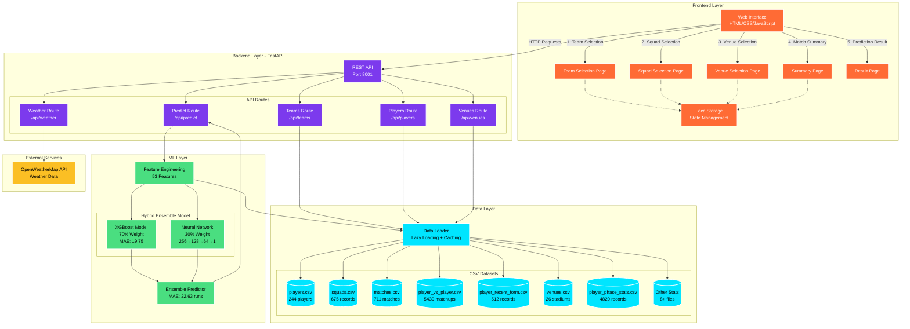
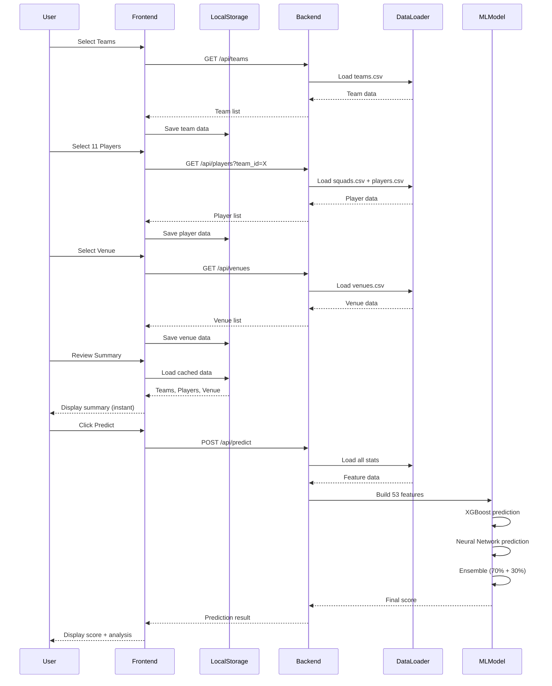

# IPL Score Predictor - System Architecture

## High-Level Architecture Diagram



## Component Details

### 1. Frontend Layer (Port 8000)
- **Technology**: HTML5, CSS3, Vanilla JavaScript
- **Pages**: 
  - Team Selection → Squad Selection → Venue Selection → Summary → Result
- **State Management**: LocalStorage for caching selected data
- **Features**:
  - Instant page loading with cached data
  - Responsive design with animations
  - Manual weather input

### 2. Backend Layer (Port 8001)
- **Technology**: FastAPI (Python)
- **API Endpoints**:
  - `GET /api/teams` - List all IPL teams
  - `GET /api/players?team_id={id}` - Get squad for a team
  - `GET /api/venues` - List all stadiums
  - `GET /api/weather/{venue_id}` - Get weather data
  - `POST /api/predict` - Generate score prediction

### 3. Data Layer
- **Storage**: CSV files (15+ datasets)
- **Loading Strategy**: Lazy loading with in-memory caching
- **Key Datasets**:
  - Player master data (244 players)
  - Match history (2015-2026)
  - Player vs Player matchups
  - Venue statistics
  - Recent form data

### 4. ML Layer
- **Feature Engineering**: 53 features including:
  - Player vs Player matchups
  - Recent form (last 5 matches)
  - Venue-specific stats
  - Phase stats (Powerplay/Middle/Death)
  - Weather conditions
  - Pitch type

- **Hybrid Ensemble Model**:
  - **XGBoost**: 2000 trees, depth=4, lr=0.01 (70% weight)
  - **Neural Network**: 256→128→64→1 architecture (30% weight)
  - **Validation MAE**: 22.63 runs
  - **Output Range**: 80-280 runs (realistic T20 scores)

### 5. External Services
- **OpenWeatherMap API**: Real-time weather data
- **Fallback**: Manual input with default values

## Data Flow



## Technology Stack

| Layer | Technology | Purpose |
|-------|-----------|---------|
| **Frontend** | HTML/CSS/JavaScript | User interface |
| **Backend** | FastAPI (Python) | REST API server |
| **ML Framework** | XGBoost + TensorFlow | Prediction models |
| **Data Processing** | Pandas + NumPy | Data manipulation |
| **Storage** | CSV files | Dataset storage |
| **Caching** | LocalStorage (Frontend) | State management |
| **Caching** | In-memory (Backend) | Data loader cache |
| **External API** | OpenWeatherMap | Weather data |

## Performance Metrics

| Component | Metric | Value |
|-----------|--------|-------|
| **Backend Startup** | Time | ~3 seconds |
| **Teams API** | Response Time | ~29ms |
| **Players API** | Response Time | ~50ms |
| **Weather API** | Timeout | 1 second |
| **Prediction API** | Response Time | ~200ms |
| **Frontend Load** | Summary Page | Instant (cached) |
| **Model Accuracy** | MAE | 22.63 runs |
| **Model Accuracy** | 5-Fold CV | 15.68 ± 0.80 runs |

## Deployment Architecture

```
┌─────────────────────────────────────────┐
│         User's Browser                   │
│  http://localhost:8000                   │
└─────────────┬───────────────────────────┘
              │
              │ HTTP Requests
              │
┌─────────────▼───────────────────────────┐
│      Frontend Server (Port 8000)        │
│      Python HTTP Server                 │
└─────────────┬───────────────────────────┘
              │
              │ REST API Calls
              │
┌─────────────▼───────────────────────────┐
│      Backend Server (Port 8001)         │
│      FastAPI + Uvicorn                  │
│                                          │
│  ┌────────────────────────────────────┐ │
│  │   ML Models (Loaded in Memory)     │ │
│  │   - XGBoost Model (xgb_model.pkl)  │ │
│  │   - MLP Model (mlp_model.pkl)      │ │
│  │   - Scaler (scaler.pkl)            │ │
│  └────────────────────────────────────┘ │
│                                          │
│  ┌────────────────────────────────────┐ │
│  │   Data Cache (In-Memory)           │ │
│  │   - Essential CSVs loaded          │ │
│  │   - Lazy loading for others        │ │
│  └────────────────────────────────────┘ │
└─────────────┬───────────────────────────┘
              │
              │ File System Access
              │
┌─────────────▼───────────────────────────┐
│         Dataset Folder                   │
│         15+ CSV Files                    │
│         Models Folder                    │
│         4 Model Files                    │
└──────────────────────────────────────────┘
```

## Key Features

1. **Lazy Loading**: Backend loads only essential data on startup, other data loaded on-demand
2. **Caching**: Frontend caches selected data in LocalStorage for instant summary page
3. **Hybrid Model**: Combines XGBoost (accuracy) + Neural Network (generalization)
4. **Feature Engineering**: 53 features from 10+ data sources
5. **Real-time Weather**: Optional API integration with manual fallback
6. **Responsive UI**: Clean, modern interface with animations
7. **Fast Predictions**: ~200ms response time for predictions

---

**Created**: 2026  
**Version**: 1.0.0  
**Model Training Data**: IPL 2015-2026
